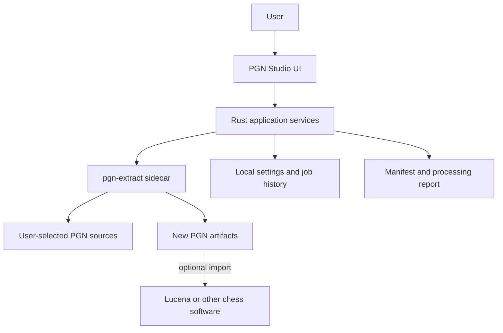
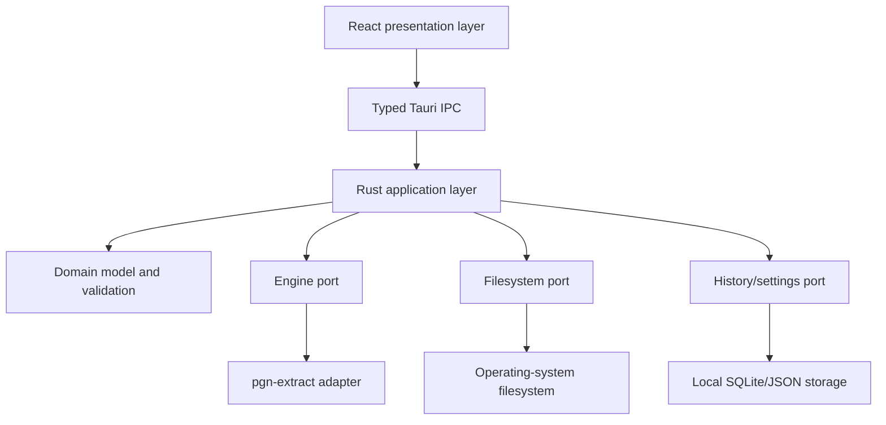

# PGN Studio — Product and Software Architecture

**Document status:** Implementation baseline  
**Last updated:** 2026-08-07  
**Intended audience:** Claude Code and human contributors  
**Product owner:** Nyvetra  
**License target:** GNU GPL v3 compatible; see [Licensing](#17-licensing-and-open-source-compliance)

---

## 1. Executive summary

PGN Studio is a free, open-source desktop application for inspecting, validating, consolidating, filtering, cleaning, deduplicating, and exporting chess games stored in Portable Game Notation (PGN). It is a standalone Nyvetra product. It is not part of Lucena, but it can prepare high-quality PGN datasets that Lucena and other chess applications can import.

PGN Studio shall initially target:

- macOS on Apple Silicon and Intel;
- Windows 10 and Windows 11 on x64;
- offline, local-file workflows;
- collections ranging from one game to several million games;
- casual users who do not know command-line syntax;
- advanced users who want transparent access to `pgn-extract` capabilities.

The application shall use:

- **Tauri 2** for the desktop shell;
- **React and TypeScript** for the user interface;
- **Rust** for trusted application services, job management, filesystem safety, and process orchestration;
- the actively maintained **`pgn-extract`** C program as a bundled sidecar for authoritative bulk PGN transformations.

PGN Studio must not reimplement `pgn-extract` in Version 1. The GUI compiles user selections into an explicit argument array, invokes the pinned sidecar without a shell, monitors it, and reports its outputs. Original files are never modified. Every transformation writes new artifacts.

The product should grow in three controlled stages:

1. **Bulk Processing:** merge, validate, filter, deduplicate, normalize, and export.
2. **Collection Explorer:** indexed browsing, search, duplicate comparison, and game preview.
3. **Game Studio:** single-game editing, board navigation, metadata editing, annotations, and curated export.

This document defines the complete direction, but Version 1 implementation must follow the MVP boundary in [Section 5](#5-release-scope).

---

## 2. Product identity

### 2.1 Name

**PGN Studio**

Working repository name:

```text
pgn-studio
```

Recommended bundle identifiers:

```text
com.nyvetra.pgnstudio
```

Recommended executable names:

```text
PGN Studio.app
PGN Studio.exe
```

### 2.2 Product statement

> PGN Studio makes professional-grade PGN processing understandable, safe, and accessible through a transparent desktop interface.

### 2.3 Relationship to Lucena

PGN Studio and Lucena are independent applications.

- PGN Studio may export clean PGN files suitable for Lucena ingestion.
- PGN Studio must not depend on Lucena code, databases, accounts, or services.
- Lucena must not be required to use PGN Studio.
- No direct Lucena database writing is included in Version 1.
- A future optional **Lucena-ready export preset** may define cleanup conventions, but the output remains standard PGN.

This separation protects both products from unnecessary coupling and keeps PGN Studio broadly useful to the chess community.

---

## 3. Goals and non-goals

### 3.1 Product goals

PGN Studio shall:

1. Let users select one or more PGN files or directories.
2. Merge multiple PGN sources into a new collection.
3. Validate game scores and separate broken games.
4. Detect duplicate move scores and produce a unique-game output.
5. Preserve a duplicate file for audit and recovery.
6. Remove selected PGN elements such as comments, variations, or NAGs.
7. Filter games by common metadata and chess criteria.
8. Add or replace ECO/opening classification using the upstream ECO resource.
9. Display the exact operation plan before execution.
10. Never silently overwrite or modify source files.
11. Remain responsive while processing very large files.
12. Support cancellation and understandable failure recovery.
13. Generate a human-readable processing report.
14. Work without accounts, subscriptions, telemetry, or network access.
15. Expose advanced capability without forcing users to learn CLI syntax.

### 3.2 Engineering goals

1. Treat `pgn-extract` as a replaceable, versioned engine adapter.
2. Keep the frontend outside the trust boundary for process execution.
3. Use typed commands and typed events across Tauri IPC.
4. Use bounded memory and streaming I/O wherever feasible.
5. Make every operation reproducible from a saved job manifest.
6. Test command generation independently of the graphical interface.
7. Build and sign native artifacts for each target platform.
8. Preserve open-source license notices and corresponding source.

### 3.3 Non-goals for Version 1

Version 1 shall not:

- become a full ChessBase or Scid replacement;
- provide cloud storage or synchronization;
- download commercial or third-party game databases;
- scrape chess websites;
- run Stockfish analysis;
- generate puzzles or coaching explanations;
- write directly into Lucena's SQLite database;
- automatically merge annotations from duplicate games;
- promise that it can choose the objectively “best” duplicate record;
- edit the user's original PGN files in place;
- allow arbitrary shell commands;
- require a Nyvetra account;
- target the Mac App Store or Microsoft Store in the initial release.

---

## 4. Core design principles

### 4.1 Safety before convenience

PGN collections can represent years of work. The application shall treat all source files as immutable. Destructive operations are prohibited in the core workflow.

### 4.2 Transparent transformation

Before running, the application shall display:

- source files;
- output artifacts;
- selected operations;
- duplicate policy;
- cleanup policy;
- overwrite policy;
- generated `pgn-extract` command in an optional advanced view.

### 4.3 Engine truth, UI clarity

The UI should explain operations in chess-user language. The adapter must remain faithful to actual `pgn-extract` behavior. The product must never claim a capability the engine does not provide.

### 4.4 Reproducibility

Each run shall create a JSON job manifest containing the application version, engine version, inputs, options, output paths, timestamps, and completion status. Users can later rerun a compatible manifest after reviewing it.

### 4.5 Offline and private by default

PGN content never leaves the user's computer. Version 1 includes no telemetry, analytics, advertising, accounts, remote logging, or network processing.

### 4.6 Progressive disclosure

Common tasks should be available through presets. Advanced flags and explanations should be available without crowding the default interface.

### 4.7 Honest progress

If the upstream process cannot provide a reliable percentage, show an indeterminate progress indicator, elapsed time, current stage, and log activity. Never fabricate a percentage.

---

## 5. Release scope

### 5.1 Version 1 MVP: Bulk Processing

The MVP is complete when a user can:

1. Add multiple PGN files.
2. Reorder the files.
3. Select an output folder and base filename.
4. Choose one of the supported presets or configure operations.
5. Validate the job before running.
6. Merge all sources.
7. optionally remove duplicate move scores;
8. optionally write duplicates to a separate PGN;
9. optionally remove comments, variations, and NAGs;
10. optionally add ECO classifications;
11. optionally filter by supported criteria;
12. run the job without freezing the interface;
13. cancel the job;
14. receive unique, duplicate, broken/error, log, and manifest artifacts as configured;
15. open the output folder from the result screen.

The MVP does not require a chessboard, game list, or manual PGN editor.

### 5.2 Version 1.1: Usability and inspection

- Fast input scan and estimated game counts.
- Recent jobs and rerun.
- File metadata and warning inspection.
- Small output preview.
- Expanded filter builder.
- More presets.
- Automatic update checks, strictly opt-in.

### 5.3 Version 2: Collection Explorer

- Local collection indexing.
- Paginated game list.
- Header search and sorting.
- Game-score preview.
- Chessboard navigation.
- Duplicate-group comparison.
- “Keep this copy” decisions.
- Metadata difference highlighting.
- Annotation-presence indicators.
- Export selected games.

### 5.4 Version 3: Game Studio

- Edit one game's headers and moves.
- Add and edit comments, NAGs, and variations.
- Legal-move validation.
- Promote or delete variations.
- Create a game from a FEN position.
- Save edits as a new PGN or project overlay.
- Create named collections and ordered exports.

---

## 6. System context



PGN Studio owns orchestration and safety. `pgn-extract` owns bulk PGN parsing and transformation. Lucena and other consumers are outside the application boundary.

---

## 7. High-level architecture

### 7.1 Architectural style

Use a layered desktop architecture with ports and adapters:



Dependencies point inward. Domain types must not depend on Tauri, React, or a particular `pgn-extract` version.

### 7.2 Technology choices

| Concern | Technology | Rationale |
|---|---|---|
| Desktop shell | Tauri 2 | Lightweight native packaging, Rust backend, explicit capabilities |
| Frontend | React + TypeScript + Vite | Mature component model and productive UI development |
| Backend | Rust stable | Safe filesystem and process orchestration; strong typed boundaries |
| Bulk engine | `pgn-extract` pinned release/commit | Mature semantic PGN processor that scales to millions of games |
| Job metadata | Rust-owned SQLite via `rusqlite`, or JSON for initial MVP | Local, portable, no external service |
| Settings | Versioned JSON in app config directory | Human-inspectable and easy to migrate |
| Logging | Rust `tracing` with rotating local logs | Structured diagnostic events without remote logging |
| Testing | Vitest, React Testing Library, Rust tests, Playwright/WebDriver where practical | Unit, component, integration, and end-to-end coverage |
| CI/release | GitHub Actions | Cross-platform builds and public source/release workflow |

All dependency versions must be pinned by lockfiles. Claude Code must check current stable versions at implementation time rather than copying version numbers from this document.

### 7.3 Why a sidecar instead of a rewrite

`pgn-extract` already:

- parses and semantically validates PGN;
- processes multiple input files;
- writes normalized SAN;
- detects move-sequence duplicates;
- filters by tags, moves, positions, and material;
- removes comments, variations, and NAGs;
- supports ECO classification;
- processes collections containing millions of games.

A rewrite would introduce chess-notation defects, delay delivery, and make parity difficult. PGN Studio should add usability, orchestration, safety, reporting, and later manual review—not replace the engine.

---

## 8. Repository structure

Recommended monorepo structure:

```text
pgn-studio/
├── README.md
├── architecture.md
├── CONTRIBUTING.md
├── CODE_OF_CONDUCT.md
├── SECURITY.md
├── LICENSE
├── THIRD_PARTY_NOTICES.md
├── package.json
├── package-lock.json
├── vite.config.ts
├── tsconfig.json
├── index.html
├── src/
│   ├── app/
│   │   ├── App.tsx
│   │   ├── routes.tsx
│   │   └── providers.tsx
│   ├── components/
│   ├── features/
│   │   ├── inputs/
│   │   ├── operations/
│   │   ├── filters/
│   │   ├── review/
│   │   ├── execution/
│   │   ├── results/
│   │   ├── history/
│   │   └── settings/
│   ├── ipc/
│   │   ├── client.ts
│   │   ├── events.ts
│   │   └── generated-types.ts
│   ├── state/
│   ├── styles/
│   ├── test/
│   └── types/
├── src-tauri/
│   ├── Cargo.toml
│   ├── Cargo.lock
│   ├── tauri.conf.json
│   ├── capabilities/
│   │   └── default.json
│   ├── binaries/
│   │   └── README.md
│   ├── resources/
│   │   ├── pgn-extract/
│   │   │   ├── COPYING
│   │   │   ├── SOURCE.json
│   │   │   └── eco.pgn
│   │   └── licenses/
│   ├── src/
│   │   ├── main.rs
│   │   ├── lib.rs
│   │   ├── commands/
│   │   ├── domain/
│   │   ├── application/
│   │   ├── engine/
│   │   │   ├── mod.rs
│   │   │   ├── capability.rs
│   │   │   ├── command_compiler.rs
│   │   │   ├── pgn_extract.rs
│   │   │   └── output_parser.rs
│   │   ├── jobs/
│   │   ├── filesystem/
│   │   ├── persistence/
│   │   ├── reporting/
│   │   └── errors/
│   └── tests/
├── engine-src/
│   ├── README.md
│   ├── upstream.lock
│   └── patches/
├── fixtures/
│   ├── valid/
│   ├── duplicates/
│   ├── malformed/
│   ├── unicode-paths/
│   └── golden/
├── scripts/
│   ├── build-pgn-extract.*
│   ├── verify-engine.*
│   ├── generate-notices.*
│   └── package-release.*
├── docs/
│   ├── user-guide.md
│   ├── engine-capabilities.md
│   ├── duplicate-semantics.md
│   └── release-process.md
└── .github/
    ├── workflows/
    ├── ISSUE_TEMPLATE/
    └── PULL_REQUEST_TEMPLATE.md
```

Do not commit undocumented third-party binaries. Every bundled binary must correspond to a recorded upstream revision and checksum.

---

## 9. Domain model

### 9.1 Job lifecycle

```text
Draft
  → Validating
  → Ready
  → Running
  → Cancelling
  → Cancelled | Succeeded | Failed
```

Only one processing job may run at a time in Version 1. This avoids disk saturation and prevents collisions with engine temporary files such as `virtual.tmp`. A queue can be added later, but each job must always receive its own working directory.

### 9.2 Primary domain types

Illustrative Rust types:

```rust
struct JobSpec {
    schema_version: u32,
    id: Uuid,
    name: String,
    inputs: Vec<InputFile>,
    output: OutputPlan,
    operations: OperationPlan,
    filters: FilterPlan,
    runtime: RuntimeOptions,
}

struct InputFile {
    path: PathBuf,
    display_name: String,
    size_bytes: u64,
    modified_at: Option<DateTime<Utc>>,
    sha256: Option<String>,
    priority: u32,
}

struct OutputPlan {
    directory: PathBuf,
    base_name: String,
    unique_games: bool,
    duplicate_games: DuplicateOutput,
    broken_games: BrokenOutput,
    log_file: bool,
    manifest: bool,
    conflict_policy: ConflictPolicy,
}

struct OperationPlan {
    merge: bool,
    validate: bool,
    duplicates: DuplicatePolicy,
    cleanup: CleanupOptions,
    eco: EcoOptions,
    output_notation: OutputNotation,
}

enum DuplicatePolicy {
    None,
    ReportAndKeepFirst,
    SuppressKeepFirst,
}

struct CleanupOptions {
    remove_comments: bool,
    remove_variations: bool,
    remove_nags: bool,
    remove_move_numbers: bool,
    remove_results: bool,
    remove_all_tags: bool,
    remove_tags: Vec<String>,
    reject_bad_results: bool,
    fix_result_tags: bool,
}

struct FilterPlan {
    tag_rules: Vec<TagRule>,
    move_bounds: Option<MoveBounds>,
    checkmate_only: bool,
    setup_policy: SetupPolicy,
    fen_pattern: Option<String>,
    textual_variations: Vec<String>,
    advanced_args: Vec<ValidatedEngineArg>,
}
```

These are domain concepts, not direct CLI flags. The engine adapter translates them into the syntax supported by the pinned engine version.

### 9.3 Job result

```rust
struct JobResult {
    job_id: Uuid,
    status: JobStatus,
    started_at: DateTime<Utc>,
    finished_at: DateTime<Utc>,
    elapsed_ms: u64,
    engine: EngineIdentity,
    artifacts: Vec<OutputArtifact>,
    metrics: ProcessingMetrics,
    warnings: Vec<JobWarning>,
    error: Option<PublicError>,
}
```

Metrics must support unknown values:

```rust
struct ProcessingMetrics {
    input_files: u64,
    input_games: Option<u64>,
    output_games: Option<u64>,
    duplicate_games: Option<u64>,
    broken_games: Option<u64>,
    input_bytes: u64,
    output_bytes: Option<u64>,
}
```

Do not substitute zero when a metric could not be measured.

---

## 10. `pgn-extract` engine integration

### 10.1 Version pinning

The repository shall pin:

- upstream repository URL;
- exact commit SHA or release archive checksum;
- engine version string;
- local patches, if any;
- compiler and target information for release binaries.

Example `engine-src/upstream.lock`:

```json
{
  "name": "pgn-extract",
  "repository": "https://github.com/kentdjb/pgn-extract",
  "commit": "REPLACE_WITH_VERIFIED_COMMIT_SHA",
  "version": "REPLACE_WITH_UPSTREAM_VERSION",
  "license": "GPL-3.0",
  "sourceArchiveSha256": "REPLACE_WITH_SHA256"
}
```

Claude Code must not invent these values. The build setup must resolve and record a real upstream revision.

### 10.2 Bundled sidecar targets

At minimum, CI shall build:

- `x86_64-pc-windows-msvc`;
- `aarch64-apple-darwin`;
- `x86_64-apple-darwin`.

Tauri external binaries require target-specific naming. The build script shall derive the expected target triple and place the corresponding sidecar in `src-tauri/binaries/`. Do not rely on the user's `PATH`.

### 10.3 Invocation boundary

The React frontend must never invoke the sidecar directly. It calls a narrow Rust command such as:

```rust
#[tauri::command]
async fn start_job(spec: JobSpecDto, state: State<'_, AppState>)
    -> Result<JobAcceptedDto, PublicErrorDto>;
```

Rust shall:

1. deserialize and validate the DTO;
2. canonicalize and check paths;
3. compile domain options into an argument vector;
4. create a private per-job working directory;
5. create criteria files where required;
6. launch only the bundled `pgn-extract` sidecar;
7. stream stdout/stderr events;
8. monitor cancellation;
9. validate expected artifacts;
10. atomically publish successful outputs;
11. write the final manifest and report.

The process must be started with an argument array, never through `sh -c`, `cmd.exe /c`, PowerShell, or concatenated command strings.

### 10.4 Capability detection

On application startup, the adapter shall execute the engine's version/help command and create an `EngineCapabilities` object. PGN Studio shall refuse to enable a UI option when the pinned engine does not advertise or pass a startup self-test for the corresponding flag.

```rust
struct EngineCapabilities {
    identity: EngineIdentity,
    duplicate_detection: bool,
    external_duplicate_table: bool,
    eco_classification: bool,
    fen_patterns: bool,
    textual_variations: bool,
    fix_result_tags: bool,
    supported_output_formats: Vec<OutputNotation>,
}
```

The app should ship with a tested static capability map for the pinned version and verify the executable identity at runtime. Help-text parsing alone is too brittle to be the permanent contract.

### 10.5 Command compiler

All command generation belongs in one pure, testable module:

```text
JobSpec + EngineCapabilities → CompiledEngineCommand
```

```rust
struct CompiledEngineCommand {
    executable: EngineExecutable,
    args: Vec<OsString>,
    working_directory: PathBuf,
    generated_files: Vec<GeneratedCriteriaFile>,
    temporary_outputs: Vec<TemporaryOutput>,
    final_outputs: Vec<FinalOutput>,
    display_command: String,
}
```

`display_command` is for user inspection only. It must never be executed.

### 10.6 Supported MVP mappings

The adapter should use long-form arguments where they are unambiguous and well supported.

| Domain action | Typical engine mapping |
|---|---|
| Merge and normalize | `--output <temp-output>` plus ordered input paths |
| Write duplicates separately | `--duplicates <temp-dupes>` |
| Suppress duplicates | `-D` / `--noduplicates` as verified for pinned version |
| Check against master without adding it | `--checkfile <master.pgn>` |
| Large duplicate table | `-Z`, inside a private job directory |
| Remove comments | `-C` / `--nocomments` |
| Remove variations | `-V` / `--novars` |
| Remove NAGs | `-N` / `--nonags` |
| Validate only | `-r` where appropriate |
| Exclude inconsistent results | `--nobadresults` |
| Correct resolvable results | `--fixresulttags` |
| Add ECO/opening tags | `-e` with a verified bundled `eco.pgn` |
| Tag filters | generated tag-criteria file plus `-t` |
| Textual move filters | generated variation file plus `-v` |
| FEN pattern | `--fenpattern` or a generated criteria file |
| Move-count bounds | engine lower/upper move-bound options |

The exact flags must be verified against the pinned upstream help. Do not copy a flag from this table without an adapter test.

### 10.7 Duplicate semantics

This behavior must be clearly explained in both UI and documentation:

- Upstream duplicate detection is based primarily on the played move sequence and final/cumulative hashes.
- Header differences do not make two identical move scores unique.
- Comments and variations are not the basis of duplicate identity.
- The first encountered copy is retained when later copies are suppressed.
- Therefore **input order is a retention priority**.
- A later duplicate may contain better metadata, comments, or variations.
- Duplicate detection is described upstream as a strong approximation, not a mathematical proof of identity.

The safe default shall be:

> Create a unique-games file **and** a duplicate-games audit file; leave all sources untouched.

Version 1 must not label this as “Keep best copy.” It is “Keep first copy.”

### 10.8 Future best-copy resolution

“Keep best copy” requires PGN Studio-owned logic and shall be a Version 2 feature. It should:

1. index duplicate groups;
2. parse headers and annotation presence;
3. score record completeness;
4. show conflicting fields;
5. allow manual selection;
6. optionally propose a preferred copy;
7. never merge move trees automatically without explicit user approval.

Possible preference signals:

- longer legal mainline;
- complete date;
- complete event/site/round;
- player Elo fields;
- ECO/opening tags;
- source/provenance field;
- comments, NAGs, and variations present;
- user-defined source priority.

The proposal must remain explainable: “Preferred because it has a complete date, ratings, and annotations.”

### 10.9 Progress and logs

The sidecar adapter shall capture stdout and stderr separately. Since output PGN is always directed to a file, stdout/stderr can be treated as diagnostic streams subject to the pinned engine's behavior.

Events emitted to the UI:

```text
job://state
job://stage
job://log-line
job://metrics
job://artifact
job://completed
```

Log volume must be bounded in frontend memory. Keep, for example, the most recent 2,000 rendered lines while writing the full log to disk.

If no reliable progress denominator exists, use:

- stage name;
- elapsed time;
- input file currently being processed when discoverable;
- a spinner/indeterminate bar;
- last log line;
- cancel button.

### 10.10 Cancellation

Cancellation shall:

1. transition the job to `Cancelling`;
2. send a normal termination request when supported;
3. wait a short bounded grace period;
4. force termination if necessary;
5. close log streams;
6. delete unpublished temporary outputs;
7. preserve a cancellation log and manifest;
8. never delete source files or previously published outputs.

Process-tree termination must be tested separately on Windows and macOS.

---

## 11. File and output safety

### 11.1 Immutable sources

No backend command may open a source PGN with write access. Reject any job whose final or temporary output resolves to the same file as an input.

### 11.2 Path validation

Before execution:

- confirm every source exists and is a regular readable file;
- accept `.pgn` case-insensitively by default;
- allow an advanced override for extensionless PGN files;
- canonicalize existing paths;
- preserve Unicode names;
- reject output directories that are not writable;
- reject input/output aliasing through symlinks when detectable;
- reject empty output names and invalid platform characters;
- calculate known input bytes;
- warn if free disk space is plausibly insufficient.

Do not require paths to contain only ASCII characters. Unicode and spaces are mandatory test cases.

### 11.3 Per-job workspace

Create:

```text
<app-cache>/jobs/<job-uuid>/
├── criteria/
├── logs/
├── engine/
├── manifest.draft.json
└── virtual.tmp      # only if created by the engine
```

Large source files must be referenced in place, not copied into the job workspace.

### 11.4 Atomic output publication

For every output:

1. choose a temporary name in the destination directory;
2. write the engine output to that temporary path;
3. ensure the sidecar exited successfully;
4. confirm the file exists and is readable;
5. optionally perform a light postflight validation;
6. atomically rename it to the final path when the platform permits;
7. write the completed manifest last.

Using the destination directory for temporary outputs improves the likelihood that rename is atomic and avoids cross-volume moves.

### 11.5 Conflict policies

```rust
enum ConflictPolicy {
    Fail,
    AddNumericSuffix,
    ReplaceAfterConfirmation,
}
```

Default: `Fail` during programmatic execution; the UI may offer `AddNumericSuffix` as the default friendly choice.

Replacing an existing output requires explicit user confirmation and should move the previous file to the operating system trash when feasible, or create a timestamped backup. Silent overwrite is prohibited.

### 11.6 Artifact naming

For base name `master-clean`:

```text
master-clean.pgn
master-clean.duplicates.pgn
master-clean.broken.pgn
master-clean.report.json
master-clean.report.txt
master-clean.log.txt
```

Only create requested or meaningful artifacts. Do not create empty duplicate/broken files unless the user enabled “Always create audit artifacts.”

---

## 12. Presets and operations

### 12.1 Preset philosophy

A preset produces a complete `JobSpec` diff, not a hidden command string. Users can inspect and modify it. Presets must be versioned.

### 12.2 Built-in presets

#### Merge Safely

- merge all sources in selected order;
- validate and normalize through `pgn-extract`;
- retain comments, variations, NAGs, tags, and results;
- do not remove duplicates;
- write a log and manifest.

#### Clean Collection

- merge sources;
- write unique games;
- write later duplicate copies to an audit PGN;
- preserve annotations;
- separate/report broken games where supported;
- write report, log, and manifest.

#### Minimal Mainline PGN

- merge sources;
- remove duplicates;
- remove comments;
- remove variations;
- remove NAGs;
- retain standard headers and results;
- normalize SAN.

#### Lucena-Ready PGN

- merge sources;
- retain only unique mainline game scores;
- remove source comments, variations, NAGs, clocks, and engine-evaluation annotations to the extent explicitly supported;
- retain standard game metadata;
- add/normalize ECO tags when enabled;
- write duplicate and error audit artifacts;
- produce standard PGN, not a Lucena-specific database.

The implementation must not claim targeted removal of clocks or engine evaluations if the engine can only remove all comments. The UI must state the actual effect.

#### Validate Only

- perform semantic validation;
- produce report/log;
- produce no transformed game collection unless the user requests a repaired/normalized output.

#### New Games Against Master

- select one master/check database;
- process one or more incoming files;
- suppress games already occurring in the master;
- output only new unique games;
- do not include the master database itself in the output.

### 12.3 Advanced arguments

Version 1 should not accept a raw shell command. If an advanced argument editor is included, it must:

- represent each argument as a separate token;
- reject executable replacement;
- reject output flags that conflict with managed outputs;
- reject unknown flags unless an “unsupported/experimental” mode is explicitly enabled;
- display a warning that advanced flags may invalidate guarantees;
- still run without a shell.

The MVP may omit arbitrary advanced arguments entirely.

---

## 13. User experience architecture

### 13.1 Main workflow

Use a five-step workflow:

```text
1. Files → 2. Operations → 3. Filters → 4. Review → 5. Run & Results
```

The user can move backward before execution without losing settings.

### 13.2 Files screen

Required elements:

- drop zone;
- Add Files button;
- Add Folder button;
- ordered source list;
- drag handles or Move Up/Down controls;
- file size;
- warnings;
- remove-from-job action;
- output folder picker;
- base filename;
- explanation that earlier files win duplicate retention.

The source order explanation must appear whenever deduplication is enabled.

### 13.3 Operations screen

Sections:

- Preset;
- Merge;
- Validation and error policy;
- Duplicate policy;
- Comments/variations/NAG cleanup;
- ECO classification;
- Output notation;
- Audit artifacts.

Options should include short plain-language explanations and a link to detailed help.

### 13.4 Filters screen

MVP filters:

- player or either player;
- White player;
- Black player;
- result;
- date/year range;
- Elo range when tags exist;
- ECO code or range;
- minimum/maximum moves;
- decisive games only;
- checkmates only;
- standard-start-only versus include SetUp/FEN games.

The backend shall convert UI filters into generated criteria files. Do not compose criteria-file syntax in React.

### 13.5 Review screen

Display:

- operation summary;
- ordered sources;
- destination artifacts;
- overwrite/conflict behavior;
- estimated input bytes;
- important warnings;
- engine identity;
- optional generated command;
- Run button.

The Run button remains disabled until backend validation returns `Ready`.

### 13.6 Run screen

- current stage;
- honest progress state;
- elapsed time;
- bounded live log;
- Cancel button;
- output paths as they are published;
- clear indication that original files remain unchanged.

### 13.7 Results screen

- success/failure/cancelled status;
- elapsed time;
- available metrics, with unknown values shown as “Not available”;
- artifact list with size;
- Open File where supported;
- Reveal in Finder/Explorer;
- Copy Path;
- View Log;
- Save/Rerun Job;
- Start New Job.

### 13.8 Accessibility

- WCAG 2.2 AA contrast target;
- complete keyboard navigation;
- visible focus states;
- semantic buttons and labels;
- screen-reader announcements for stage/status changes;
- no meaning communicated only by color;
- reduced-motion support;
- scalable text and layouts;
- native menu shortcuts where appropriate.

---

## 14. Tauri IPC contract

### 14.1 Commands

Recommended command surface:

```text
get_app_info()
get_engine_info()
get_engine_capabilities()
select_input_files()
select_input_directory()
select_output_directory()
inspect_inputs(paths)
validate_job(spec)
compile_job_preview(spec)
start_job(spec)
cancel_job(job_id)
get_job(job_id)
list_recent_jobs(limit)
delete_job_history(job_id)
reveal_path(path)
open_path(path)
get_settings()
update_settings(patch)
```

File dialogs may be initiated through trusted Tauri plugins, but all selected paths still require Rust validation.

### 14.2 Events

```typescript
type JobEvent =
  | { type: "state"; jobId: string; state: JobState }
  | { type: "stage"; jobId: string; stage: JobStage; message: string }
  | { type: "log"; jobId: string; level: LogLevel; line: string }
  | { type: "metrics"; jobId: string; metrics: Partial<ProcessingMetrics> }
  | { type: "artifact"; jobId: string; artifact: OutputArtifact }
  | { type: "completed"; jobId: string; result: JobResult };
```

Every event carries a job ID. The frontend must ignore events for an obsolete or different job.

### 14.3 Type synchronization

Do not manually maintain duplicate TypeScript and Rust definitions indefinitely. Use a Rust-to-TypeScript generator compatible with the chosen Tauri stack, or generate a JSON Schema/OpenAPI-like artifact during CI. Generated types are committed or reproducibly generated and checked for drift.

---

## 15. Persistence and configuration

### 15.1 Settings

Store non-sensitive settings in versioned JSON under the platform app-config directory:

```json
{
  "schemaVersion": 1,
  "theme": "system",
  "defaultOutputDirectory": null,
  "defaultConflictPolicy": "addNumericSuffix",
  "rememberRecentFiles": true,
  "maxRecentJobs": 50,
  "showAdvancedCommand": false,
  "updateChecks": "off"
}
```

No secrets are required in Version 1.

### 15.2 Job history

For the simplest MVP, job history may be a bounded collection of JSON manifests. If searchable persistent history is implemented, use a Rust-owned SQLite database.

Suggested tables:

```sql
CREATE TABLE jobs (
    id TEXT PRIMARY KEY,
    name TEXT NOT NULL,
    state TEXT NOT NULL,
    created_at TEXT NOT NULL,
    started_at TEXT,
    finished_at TEXT,
    app_version TEXT NOT NULL,
    engine_version TEXT NOT NULL,
    manifest_path TEXT NOT NULL,
    error_code TEXT
);

CREATE TABLE job_inputs (
    job_id TEXT NOT NULL,
    ordinal INTEGER NOT NULL,
    path TEXT NOT NULL,
    size_bytes INTEGER,
    sha256 TEXT,
    PRIMARY KEY (job_id, ordinal),
    FOREIGN KEY (job_id) REFERENCES jobs(id) ON DELETE CASCADE
);

CREATE TABLE job_artifacts (
    job_id TEXT NOT NULL,
    kind TEXT NOT NULL,
    path TEXT NOT NULL,
    size_bytes INTEGER,
    sha256 TEXT,
    PRIMARY KEY (job_id, kind, path),
    FOREIGN KEY (job_id) REFERENCES jobs(id) ON DELETE CASCADE
);
```

Do not store complete PGN content in the history database.

### 15.3 Manifest format

The manifest must contain:

- schema version;
- PGN Studio version;
- `pgn-extract` version and commit/checksum identity;
- operating system and architecture;
- job configuration;
- ordered input paths and metadata;
- optional hashes;
- generated criteria-file hashes;
- sanitized argument vector;
- start/end timestamps;
- exit code;
- warnings/errors;
- output artifact paths, sizes, and optional hashes.

Input hashing can be optional for very large files because it requires a full additional read. If disabled, record size and modification time and label identity as non-cryptographic.

---

## 16. Security and privacy

### 16.1 Threat model

Relevant risks include:

- malicious filenames or paths;
- command injection through filter text;
- writing over valuable source files;
- symlink/path aliasing;
- disk exhaustion from very large outputs or `virtual.tmp`;
- malformed PGNs designed to crash or hang the engine;
- tampered bundled sidecar binaries;
- unbounded frontend logs or memory use;
- unsafe update artifacts;
- accidental disclosure of private PGN paths in public bug reports.

### 16.2 Controls

- Never invoke a shell.
- Pass arguments as OS-native tokens.
- Restrict execution to the bundled sidecar.
- Use minimal Tauri permissions/capabilities.
- Keep direct filesystem operations in Rust.
- Require explicit user-selected source and destination paths.
- Validate output/input non-aliasing.
- Use per-job working directories.
- Bound logs and queues.
- Provide cancellation and time/resource warnings.
- Verify release sidecar checksums during packaging and startup self-test.
- Sign/notarize application releases.
- Remove or redact user paths from optional diagnostic bundles unless the user approves inclusion.
- Do not transmit data or logs in Version 1.

### 16.3 Tauri capabilities

The default capability should grant only:

- the required dialog functionality;
- narrowly scoped app-config/app-cache access;
- permission to spawn the named bundled sidecar;
- explicitly required window/event behavior.

Do not grant broad shell execution, arbitrary command spawning, or unrestricted filesystem access to frontend JavaScript.

### 16.4 Content Security Policy

Use a restrictive CSP:

- local application assets only;
- no remote scripts;
- no `eval`;
- no remote images by default;
- no arbitrary navigation;
- no network access required for core workflows.

---

## 17. Licensing and open-source compliance

### 17.1 Project license

PGN Studio shall use a GPLv3-compatible open-source license. The simplest conservative choice is to license the complete distributed project under **GPL-3.0**, matching the bundled `pgn-extract` engine's license obligations.

Before choosing `GPL-3.0-only` versus `GPL-3.0-or-later`, inspect the exact upstream source headers and `COPYING` file for the pinned revision. Do not infer “or later” without verification.

### 17.2 Bundled engine obligations

Every release that distributes `pgn-extract` shall include:

- upstream copyright notices;
- full GPL license text;
- corresponding source for the exact binary, or a compliant durable written/source offer as reviewed by the project;
- all local patches;
- build instructions;
- upstream repository and pinned revision;
- clear notice that `pgn-extract` is a third-party component;
- a `THIRD_PARTY_NOTICES.md` entry.

The public PGN Studio repository should contain enough information to rebuild every bundled engine binary.

### 17.3 Data licensing

PGN Studio is a processor, not a data supplier. It shall not bundle a commercial game database. Test fixtures must be:

- created by contributors;
- clearly public domain/CC0; or
- sufficiently minimal synthetic fixtures for testing.

The bundled `eco.pgn` inherits its own upstream licensing and must be covered in the notices and corresponding source materials.

### 17.4 Contributor policy

Use Developer Certificate of Origin (`Signed-off-by`) or a lightweight contributor agreement only if Nyvetra later determines it is necessary. The default should favor easy community contribution while preserving clear provenance.

This section is an engineering compliance plan, not legal advice. Obtain legal review before the first public binary release if Nyvetra has questions about bundled GPL components or app-store terms.

---

## 18. Error model and recovery

### 18.1 Error taxonomy

```text
INPUT_NOT_FOUND
INPUT_NOT_READABLE
INPUT_OUTPUT_COLLISION
OUTPUT_NOT_WRITABLE
OUTPUT_EXISTS
INSUFFICIENT_DISK_SPACE
INVALID_JOB_SPEC
UNSUPPORTED_ENGINE_OPTION
ENGINE_MISSING
ENGINE_TAMPERED
ENGINE_START_FAILED
ENGINE_EXIT_NONZERO
ENGINE_OUTPUT_MISSING
ENGINE_OUTPUT_INVALID
JOB_ALREADY_RUNNING
JOB_CANCELLED
TEMP_CLEANUP_FAILED
HISTORY_WRITE_FAILED
UNKNOWN_INTERNAL_ERROR
```

### 18.2 Public error shape

```rust
struct PublicError {
    code: ErrorCode,
    title: String,
    message: String,
    remediation: Option<String>,
    log_path: Option<PathBuf>,
    technical_id: Uuid,
}
```

Do not expose Rust backtraces or raw internal errors in the default UI. Preserve them in the local log.

### 18.3 Failure behavior

On engine failure:

- do not publish partial final outputs;
- retain logs and manifest;
- remove temporary output where safe;
- tell the user whether any temporary files remain;
- offer Reveal Log;
- allow the configuration to be edited and rerun;
- keep source files untouched.

If cleanup fails, report the exact temporary directory instead of claiming it was deleted.

---

## 19. Performance and scalability

### 19.1 Target sizes

Design targets:

| Tier | Collection size | Expected behavior |
|---|---:|---|
| Small | 1–10,000 games | Immediate setup; responsive processing UI |
| Medium | 10,000–1,000,000 games | Streaming processing; no UI degradation |
| Large | 1,000,000+ games | Bounded memory; disk/time warnings; cancellable |

PGN Studio should not publish universal time estimates. Performance depends on file size, storage speed, filters, annotations, and duplicate-table mode.

### 19.2 Memory

- Never load a complete large PGN into React.
- Do not hold complete process logs in memory.
- Stream file hashing and inspection.
- Let `pgn-extract` own PGN bulk processing.
- Use the engine's external duplicate table mode (`-Z`) when necessary, in a private working directory.
- Warn about temporary-disk requirements before enabling external duplicate storage on very large collections.

### 19.3 Concurrency

Version 1 permits one active engine process. Auxiliary tasks such as hashing should use bounded worker concurrency and should not compete with the main job by default.

### 19.4 UI responsiveness

All filesystem scanning, hashing, process execution, and result counting must occur outside the frontend rendering thread. Event emission should be throttled/batched if the engine produces high-frequency log output.

---

## 20. Testing strategy

### 20.1 Unit tests

Rust:

- `JobSpec` validation;
- conflict-policy resolution;
- path collision detection;
- artifact naming;
- criteria-file generation;
- command compilation;
- option/capability compatibility;
- output parsing;
- error redaction;
- manifest serialization and migration.

TypeScript:

- reducers/stores;
- preset application;
- form validation presentation;
- workflow navigation;
- event correlation by job ID;
- unknown metric rendering;
- accessibility behavior.

### 20.2 Golden command tests

Each supported workflow shall have a checked-in expected argument vector. Test argument arrays, not only display strings.

Examples:

- merge two files;
- merge and deduplicate with audit output;
- validate only;
- remove comments/variations/NAGs;
- add ECO;
- filter by Tal games and date range;
- check new games against a master file;
- Unicode and spaced paths;
- Windows paths containing parentheses and ampersands.

### 20.3 Engine integration fixtures

Fixtures must include:

- two byte-identical games;
- same moves with different headers;
- same moves with annotations in only one copy;
- same players/year but different games;
- a truncated score sharing an opening with a complete score;
- games with SetUp/FEN tags;
- comments containing brackets and unusual Unicode;
- variations and NAGs;
- malformed quotes;
- illegal moves;
- inconsistent Result tags;
- no final result marker;
- very long comments;
- CRLF and LF line endings;
- UTF-8 BOM;
- file and folder names in Bengali and other non-Latin scripts.

### 20.4 End-to-end tests

1. Select fixtures.
2. Configure Clean Collection.
3. Review plan.
4. Run bundled sidecar.
5. Verify originals are byte-identical.
6. Verify golden unique/duplicate outputs.
7. Verify manifest and logs.
8. Verify cancellation removes unpublished output.
9. Verify conflict policies.
10. Verify open/reveal actions on each platform.

### 20.5 Release smoke tests

On clean systems:

- install/uninstall;
- engine startup self-test;
- run a small merge;
- run a duplicate cleanup;
- use Unicode paths;
- cancel a run;
- confirm macOS Gatekeeper acceptance after notarization;
- confirm Windows signature/SmartScreen behavior;
- confirm no external runtime is required beyond platform prerequisites bundled/configured by Tauri.

---

## 21. Build, CI, signing, and distribution

### 21.1 CI matrix

Suggested GitHub Actions matrix:

```text
Windows x64        windows-latest
macOS Apple Silicon macos-14 or current ARM runner
macOS Intel        macos-13 or current Intel runner
```

Jobs:

1. lint frontend;
2. test frontend;
3. format/lint Rust;
4. test Rust;
5. build pinned `pgn-extract`;
6. verify engine checksums and self-tests;
7. build Tauri bundles;
8. run platform smoke tests where possible;
9. generate notices and source bundle;
10. sign/notarize release artifacts when secrets are available;
11. publish GitHub Release assets.

### 21.2 macOS distribution

Initial distribution should be a directly downloaded, signed and notarized DMG containing a universal app or separate Apple Silicon/Intel builds.

Requirements:

- Apple Developer ID Application certificate;
- hardened runtime as required;
- signing of the main app and bundled sidecar;
- notarization;
- stapling where applicable;
- validation on a clean Mac.

Do not target the Mac App Store in Version 1.

### 21.3 Windows distribution

Produce:

- MSI or NSIS installer, based on current Tauri support;
- optional portable ZIP only after update/config behavior is defined;
- Authenticode-signed executables and installer for public release.

The bundled sidecar must also be included in signature and integrity verification planning.

### 21.4 Updates

Version 1 may use manual GitHub Releases. If automatic updates are later added:

- update checks are opt-in or clearly disclosed;
- update metadata is signed;
- release artifacts are signed;
- failed updates roll back;
- updating the app never modifies user PGNs;
- app and engine versions remain separately visible.

### 21.5 Release contents

Every public release should provide:

- platform installers;
- checksums;
- source archive;
- exact corresponding `pgn-extract` source and patches or a clearly linked compliant source bundle;
- license texts;
- third-party notices;
- changelog;
- known limitations;
- reproducibility/build instructions.

---

## 22. Observability and diagnostics

### 22.1 Local logging

Use structured local logs with:

- timestamp;
- level;
- job ID;
- stage;
- component;
- error code;
- sanitized message.

Default retention: a bounded number of files and total size. Provide “Clear Logs.”

### 22.2 Diagnostic bundle

A future “Create Diagnostic Bundle” feature may include:

- app and engine versions;
- OS/architecture;
- capability self-test;
- selected job manifest;
- log excerpts;
- redacted settings.

It must exclude PGN content and redact full user paths by default. The app does not upload the bundle; the user decides whether to share it.

### 22.3 No telemetry in Version 1

There shall be no analytics SDK, crash-upload SDK, or remote error collection. Community feedback occurs through GitHub issues, with user-controlled attachments.

---

## 23. Future Collection Explorer architecture

This section guides later work and must not expand the MVP.

### 23.1 Local index

Build a disposable/rebuildable SQLite index containing headers and source locations—not a replacement for the PGN source.

```sql
CREATE TABLE indexed_files (
    id INTEGER PRIMARY KEY,
    path TEXT NOT NULL UNIQUE,
    size_bytes INTEGER NOT NULL,
    modified_at TEXT,
    fingerprint TEXT
);

CREATE TABLE indexed_games (
    id INTEGER PRIMARY KEY,
    file_id INTEGER NOT NULL,
    ordinal INTEGER NOT NULL,
    byte_offset INTEGER,
    byte_length INTEGER,
    white TEXT,
    black TEXT,
    event TEXT,
    site TEXT,
    game_date TEXT,
    round TEXT,
    result TEXT,
    white_elo INTEGER,
    black_elo INTEGER,
    eco TEXT,
    ply_count INTEGER,
    has_comments INTEGER NOT NULL DEFAULT 0,
    has_variations INTEGER NOT NULL DEFAULT 0,
    move_hash TEXT,
    FOREIGN KEY (file_id) REFERENCES indexed_files(id) ON DELETE CASCADE,
    UNIQUE (file_id, ordinal)
);
```

The index can be regenerated whenever source fingerprints change.

### 23.2 Parser boundary

A streaming Rust PGN reader may be added for indexing and preview. It must not silently replace `pgn-extract` as the authoritative bulk transformation engine. Parser disagreement becomes a reported warning and fixture.

### 23.3 Duplicate review

Duplicate groups should be materialized into the index with:

- retained record;
- suppressed records;
- source priority;
- conflicting headers;
- annotation/variation presence;
- user decision;
- rationale.

Manual decisions should compile into a deterministic export plan.

### 23.4 Editing model

Never edit a giant PGN in place. Store edits as project overlays:

```text
Original game reference + replacement PGN + edit metadata
```

An export operation applies overlays to a new PGN. This preserves source immutability and enables undo/history.

---

## 24. Implementation plan for Claude Code

Claude Code should implement in vertical slices. Each slice must end with working tests and a runnable application.

### Phase 0: Repository and compliance scaffold

- Initialize Tauri 2 + React + TypeScript.
- Add Rust workspace conventions.
- Add GPL-compatible license after upstream verification.
- Add notices, contribution, security, and code-of-conduct files.
- Pin upstream `pgn-extract` revision.
- Create repeatable engine build scripts.
- Bundle `eco.pgn` and source notices correctly.
- Add CI lint/test skeleton.

**Exit criterion:** Clean builds on development macOS and Windows targets; engine identity test passes.

### Phase 1: Engine adapter proof

- Bundle sidecar for current development platform.
- Implement `get_engine_info` and capability self-test.
- Implement typed `JobSpec` subset.
- Implement command compiler for a two-file merge.
- Run sidecar without a shell.
- Publish output atomically.
- Capture logs and exit status.

**Exit criterion:** Two fixture PGNs merge through the GUI/backend boundary, and originals remain byte-identical.

### Phase 2: Core workflow UI

- Files step with drag/drop and ordering.
- Output selection.
- Operations step.
- Review step.
- Run/result step.
- Backend validation.
- Tauri job events.
- Cancellation.

**Exit criterion:** A nontechnical user can merge files and understand where the output went.

### Phase 3: Deduplication and audit

- Report-and-keep-first mode.
- Suppress-keep-first mode.
- Duplicate output artifact.
- Input-priority explanation.
- Golden duplicate fixtures.
- Large-set external hash mode with isolated workspace.

**Exit criterion:** Exact move-sequence duplicate fixtures produce verified unique and duplicate outputs, including annotated-duplicate warnings.

### Phase 4: Cleanup, validation, and ECO

- Comments/variations/NAG controls.
- Validation-only preset.
- Result policies.
- ECO classification.
- Broken/error reporting based on verified engine behavior.
- Presets and versioning.

**Exit criterion:** Golden outputs match the pinned engine for every supported option.

### Phase 5: Filters

- Typed filter builder.
- Backend-generated tag criteria.
- Move bounds.
- Checkmate/result/date/Elo/ECO filters.
- FEN and textual variations as advanced filters if time permits.

**Exit criterion:** Each filter has at least one positive, negative, and combination test.

### Phase 6: Persistence and release quality

- Settings migration.
- Job manifests and recent history.
- Diagnostic logs.
- Accessibility pass.
- macOS signing/notarization.
- Windows installer/signing.
- Source/license bundles.
- User documentation.

**Exit criterion:** Signed release candidates pass clean-machine smoke tests.

### Phase 7: Explorer, after Version 1

- Streaming indexer.
- Game list and search.
- Board preview.
- Duplicate comparison.
- Manual keep-copy decisions.

Do not begin Phase 7 before Version 1 safety and release criteria pass.

---

## 25. MVP acceptance criteria

The first public release is acceptable only when all statements below are true.

### Functional

- [ ] Users can select multiple PGNs and reorder them.
- [ ] Users can merge files into one new PGN.
- [ ] Users can create unique and duplicate audit outputs.
- [ ] Users can remove comments, variations, and NAGs independently.
- [ ] Users can run supported validation and ECO operations.
- [ ] Users can configure the agreed MVP filters.
- [ ] Users can cancel an active job.
- [ ] Users receive a manifest and understandable result.

### Safety

- [ ] Original input hashes are unchanged in integration tests.
- [ ] The application rejects source/output collisions.
- [ ] The application never invokes a shell.
- [ ] Partial outputs are not published as successful artifacts.
- [ ] Existing output conflicts are handled explicitly.
- [ ] Each run has an isolated work directory.
- [ ] Cancellation does not remove source or prior output files.

### Quality

- [ ] Golden fixtures pass on Windows x64 and both macOS architectures.
- [ ] Unicode paths work.
- [ ] UI remains responsive during large fixture processing.
- [ ] Unknown metrics are not displayed as zero.
- [ ] Core workflow is keyboard accessible.
- [ ] Error messages include actionable remediation.

### Distribution and compliance

- [ ] Windows installer is signed for public release.
- [ ] macOS app and sidecar are signed and notarized.
- [ ] Exact engine source and patches are available.
- [ ] GPL and third-party notices are bundled.
- [ ] Release checksums are published.
- [ ] A clean system does not require the user to install `pgn-extract` manually.

---

## 26. Key architecture decisions

| ID | Decision | Status |
|---|---|---|
| ADR-001 | PGN Studio is standalone from Lucena | Accepted |
| ADR-002 | Product is free and open source | Accepted |
| ADR-003 | Tauri 2 + React/TypeScript + Rust | Accepted |
| ADR-004 | Bundle and orchestrate pinned `pgn-extract`; do not rewrite it for V1 | Accepted |
| ADR-005 | Original PGNs are immutable | Accepted |
| ADR-006 | Sidecar is invoked only by Rust and never through a shell | Accepted |
| ADR-007 | One active bulk job in V1 | Accepted |
| ADR-008 | Duplicate default retains first source copy and writes an audit file | Accepted |
| ADR-009 | “Keep best duplicate” is deferred until a review/index layer exists | Accepted |
| ADR-010 | Core workflows are offline with no telemetry | Accepted |
| ADR-011 | Direct signed DMG/Windows installer distribution before app stores | Accepted |
| ADR-012 | Lucena-ready output remains standard PGN | Accepted |

New decisions that materially change these assumptions should be documented as ADR files under `docs/adr/`.

---

## 27. Known risks

| Risk | Impact | Mitigation |
|---|---|---|
| Duplicate copies contain different annotations | Useful information could be suppressed | Default audit output; input priority; future duplicate reviewer |
| Engine output/log format changes | Metrics or diagnostics break | Pin engine; adapter tests; capability self-test |
| Very large duplicate hash table exhausts memory | Job failure | Offer isolated `-Z` mode; disk warnings; cancellation |
| Malformed PGN crashes engine | Job failure | Process isolation; fixtures; preserve logs; never modify source |
| macOS/Windows signing cost and setup | Installation warnings | Plan certificates early; automate signed release workflow |
| GPL compliance omission | Release/legal risk | Source bundle, notices, pinned revisions, compliance checklist |
| Scope expands into full database editor | Delayed useful release | Enforce phased MVP; Explorer and Game Studio after bulk workflow |
| Progress cannot be measured exactly | User uncertainty | Honest indeterminate progress, elapsed time, stage, logs |
| Two parsers disagree in future Explorer | Incorrect preview/index | Keep `pgn-extract` authoritative; report disagreement; golden tests |

---

## 28. References

Primary technical references:

- [`pgn-extract` official site and downloads](https://www.cs.kent.ac.uk/people/staff/djb/pgn-extract/)
- [`pgn-extract` official help](https://www.cs.kent.ac.uk/people/staff/djb/pgn-extract/help.html)
- [`pgn-extract` original-author repository](https://github.com/kentdjb/pgn-extract)
- [Tauri 2 architecture](https://v2.tauri.app/concept/architecture/)
- [Tauri 2 external binaries/sidecars](https://v2.tauri.app/develop/sidecar/)
- [Tauri 2 distribution](https://v2.tauri.app/distribute/)
- [Tauri macOS code signing and notarization](https://v2.tauri.app/distribute/sign/macos/)
- [Tauri Windows code signing](https://v2.tauri.app/distribute/sign/windows/)

The upstream documentation states that `pgn-extract` can process millions of games and supports semantic validation, duplicate detection, filtering, formatting, and cross-platform compilation. Its duplicate documentation also warns that duplicate identity is based on moves and that copies may contain different annotations or variations. Those facts are central to PGN Studio's safe default behavior.

---

## 29. Final implementation directive

Claude Code should treat this document as the architecture baseline, not as permission to implement all future features at once.

The first objective is a trustworthy workflow:

> Select PGNs → review explicit operations → run pinned `pgn-extract` safely → receive new, auditable output files without altering the originals.

When a desired behavior cannot be guaranteed by the pinned engine, the application must either implement and test that behavior explicitly in the Rust application layer or label it unsupported. It must never simulate success, silently weaken the user's selection, or infer that a duplicate copy is inferior merely because it appeared later.

